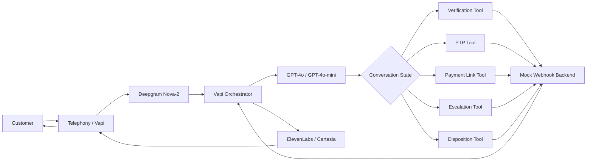
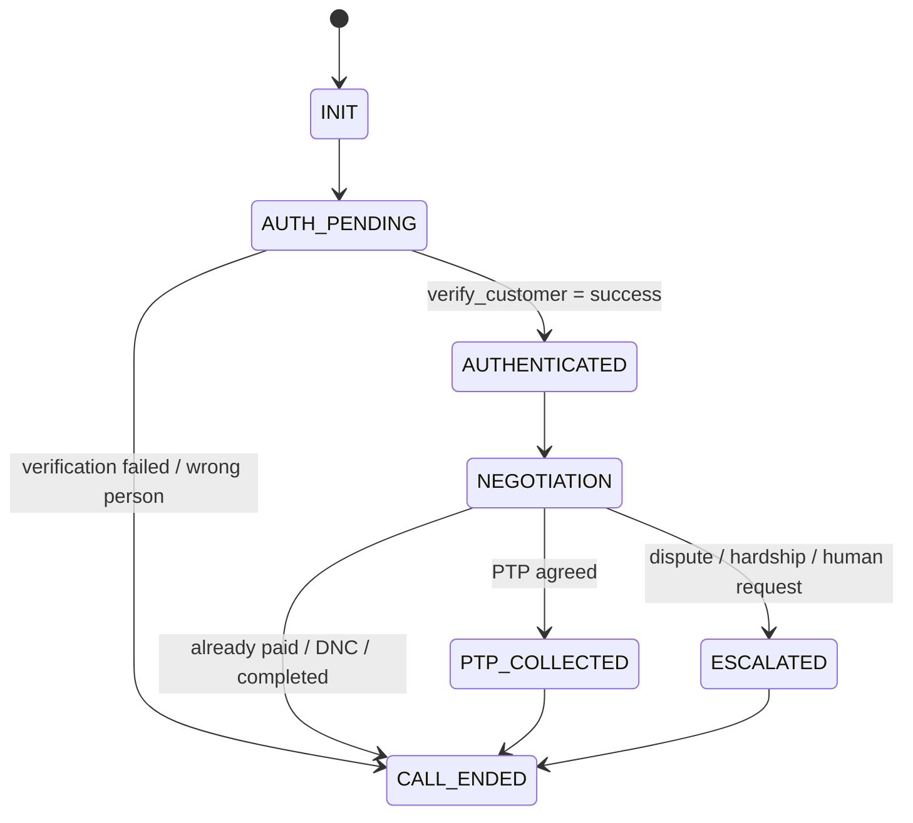
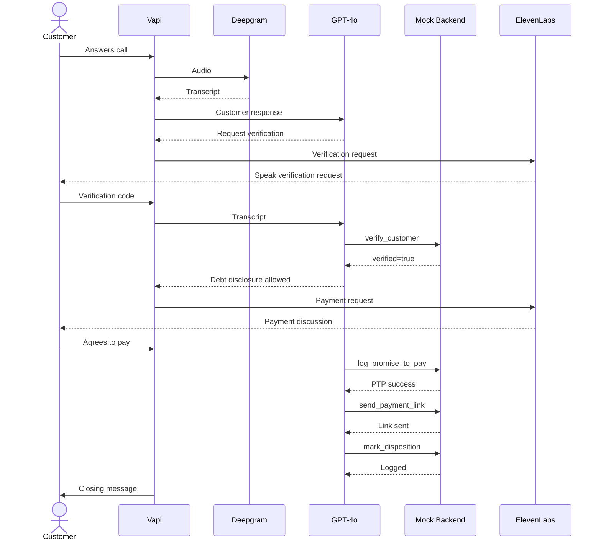

# Kapture Collections Voicebot – High-Level Design Document

## 1. Overview

### 1.1 Purpose

This document describes the high-level architecture and engineering design of **Maya**, an automated outbound Voice AI Collections Agent for Kapture Finance.

The system enables Maya to:

* Authenticate a customer before revealing sensitive information.
* Discuss overdue payment details after successful authentication.
* Identify customer intent.
* Capture Promise-to-Pay (PTP).
* Send payment links through mock tools.
* Handle already-paid, hardship, dispute, wrong-person, and DNC scenarios.
* Escalate appropriate cases to human agents.
* Record the final call disposition.

### 1.2 Example Customer

```text
Customer: Rahul Sharma
Account ID: ACC-88392
Overdue Amount: ₹8,499
Days Past Due: 12
```

---

# 2. System Architecture



## 2.1 Component Responsibilities

| Component             | Responsibility                                      |
| --------------------- | --------------------------------------------------- |
| Telephony / Vapi      | Voice call orchestration                            |
| Deepgram Nova-2       | Speech-to-text                                      |
| GPT-4o / GPT-4o-mini  | Conversation reasoning and intent handling          |
| Conversation State    | Controls allowed transitions                        |
| Mock Backend          | Executes business tools                             |
| ElevenLabs / Cartesia | Text-to-speech                                      |
| Tool Layer            | Verification, PTP, payment, escalation, disposition |

---

# 3. Voice Processing Pipeline

```text
Customer Speech
      ↓
Telephony
      ↓
Vapi
      ↓
Deepgram Nova-2
      ↓
Speech Transcript
      ↓
GPT-4o / GPT-4o-mini
      ↓
Conversation State + Intent
      ↓
Tool Call if Required
      ↓
Response Generation
      ↓
ElevenLabs / Cartesia
      ↓
Customer
```

The target is to maintain conversational responsiveness with an end-to-end latency target of **less than 1.2 seconds**.

---

# 4. Latency Budget

| Pipeline Component    |            Target |
| --------------------- | ----------------: |
| STT – Deepgram Nova-2 |           ~200 ms |
| LLM First Byte        |           ~400 ms |
| TTS Synthesis         |           ~300 ms |
| Network Overhead      |           ~200 ms |
| **Total Target**      | **< 1.2 seconds** |

The latency target follows the assignment specification.

---

# 5. Conversation State Machine

The voicebot uses explicit conversation states to prevent unauthorized transitions.



## 5.1 State Definitions

### INIT

Call begins and Maya introduces herself.

No debt information is disclosed.

### AUTH_PENDING

Maya requests customer verification.

Example:

```text
"For security purposes, could you please confirm the last
4 digits of your PAN or your year of birth?"
```

### AUTHENTICATED

This state can only be reached when:

```text
verify_customer → verified: true
```

Debt information becomes available only after this transition.

### NEGOTIATION

Maya identifies the customer's intent and selects the appropriate workflow.

### PTP_COLLECTED

A valid payment date and amount have been captured and recorded.

### ESCALATED

The conversation requires human intervention.

### CALL_ENDED

Final disposition is recorded and the call is terminated.

---

# 6. Authentication & Data Safety

## 6.1 Authentication Gate

The most important security rule is:

```text
AUTH_PENDING
      ↓
verify_customer
      ↓
SUCCESS?
      ↓
AUTHENTICATED
```

The LLM must not independently decide that authentication succeeded.

The backend tool result is the source of truth.

## 6.2 Pre-Authentication Restrictions

Before successful verification, Maya must not reveal:

* Overdue amount
* Loan information
* EMI information
* Debt information
* Kapture Finance debt details

This prevents accidental disclosure to a third party.

## 6.3 PII Protection

Logs should mask personally identifiable information.

Example:

```text
Rahul Sharma
```

should be logged as:

```text
Rahul S****
```

The assignment specifically requires PII masking and zero debt disclosure before authentication.

---

# 7. Intent Handling

| Intent           | Action                                           |
| ---------------- | ------------------------------------------------ |
| Confirm Identity | Continue authentication                          |
| Promise to Pay   | Capture PTP date and amount                      |
| Hardship Claim   | Capture reason and escalate/offer allowed option |
| Dispute Debt     | Escalate to human                                |
| Already Paid     | Capture payment details and disposition          |
| Request DNC      | Log DNC and terminate                            |
| Wrong Person     | Log wrong-person disposition and terminate       |

## 7.1 Important Entities

| Entity              | Type          |
| ------------------- | ------------- |
| `PTP_Date`          | ISO-8601 date |
| `PTP_Amount`        | Number        |
| `Hardship_Reason`   | String        |
| `Verification_Code` | String        |

---

# 8. Business Tools / APIs

## 8.1 verify_customer

Purpose: Verify the customer's identity.

```json
{
  "account_id": "ACC-88392",
  "verification_code": "1234"
}
```

Example successful response:

```json
{
  "verified": true,
  "message": "Identity verified successfully."
}
```

---

## 8.2 log_promise_to_pay

Purpose: Record the customer's Promise-to-Pay.

```json
{
  "account_id": "ACC-88392",
  "ptp_date": "2026-08-14",
  "amount": 8499
}
```

Example response:

```json
{
  "success": true,
  "ptp_id": "PTP-9921"
}
```

---

## 8.3 send_payment_link

Purpose: Trigger a payment link through the customer's registered communication channel.

```json
{
  "account_id": "ACC-88392",
  "channel": "SMS"
}
```

Supported channels:

```text
SMS
WhatsApp
BOTH
```

---

## 8.4 escalate_to_agent

Purpose: Route cases requiring human intervention.

Example:

```json
{
  "account_id": "ACC-88392",
  "reason": "DISPUTE"
}
```

Typical escalation reasons:

```text
HARDSHIP_REQUEST
DISPUTE
CUSTOMER_REQUEST
COMPLEX_CASE
```

---

## 8.5 mark_disposition

Purpose: Record the final call outcome.

Example:

```json
{
  "account_id": "ACC-88392",
  "status": "PTP_AGREED",
  "notes": "Customer agreed to pay on Friday."
}
```

Supported statuses include:

```text
PTP_AGREED
ALREADY_PAID
DISPUTED
HARDSHIP_ESCALATED
WRONG_PERSON
DO_NOT_CALL
NO_RESPONSE
```

The five-tool API design is required by the assignment.

---

# 9. Standard Happy Path



---

# 10. Intent-Based Routing

## 10.1 Customer Will Pay

```text
Customer agrees to pay
        ↓
Capture payment date
        ↓
log_promise_to_pay
        ↓
send_payment_link
        ↓
mark_disposition
        ↓
End Call
```

## 10.2 Already Paid

```text
Customer says already paid
        ↓
Ask payment date/method
        ↓
mark_disposition(ALREADY_PAID)
        ↓
Inform customer processing may take 24–48 hours
        ↓
End Call
```

## 10.3 Financial Hardship

```text
Customer cannot pay
        ↓
Capture hardship reason
        ↓
Offer allowed option / escalate
        ↓
escalate_to_agent
        ↓
End Call
```

## 10.4 Dispute

```text
Customer disputes debt
        ↓
Do not argue
        ↓
escalate_to_agent(DISPUTE)
        ↓
End Call
```

## 10.5 DNC

```text
Customer requests no further calls
        ↓
mark_disposition(DO_NOT_CALL)
        ↓
Terminate immediately
```

## 10.6 Wrong Person

```text
Person is not Rahul
        ↓
Ask whether Rahul is available
        ↓
If unavailable:
mark_disposition(WRONG_PERSON)
        ↓
End Call
```

---

# 11. Edge Case Matrix

| Edge Case             | System Behavior                                             |
| --------------------- | ----------------------------------------------------------- |
| Failed authentication | No debt disclosure; retry or terminate                      |
| Wrong person          | Mark `WRONG_PERSON` and terminate                           |
| Already paid          | Capture payment information and mark `ALREADY_PAID`         |
| Hardship              | Capture reason and escalate                                 |
| Dispute               | Escalate to human                                           |
| DNC                   | Mark `DO_NOT_CALL` and terminate                            |
| Abusive customer      | One warning, then soft hang-up                              |
| Silent customer       | Two re-prompts, then terminate with no-response disposition |
| Voicemail             | Do not disclose debt information                            |
| Hindi/Hinglish        | Switch language while preserving state                      |
| Human-agent request   | Escalate                                                    |
| Unsupported request   | Escalate                                                    |

The assignment specifically calls out abusive users, silent/voicemail cases, and language switching as edge cases.

---

# 12. Compliance Guardrails

The agent must:

1. Authenticate before debt disclosure.
2. Never disclose debt information to a third party.
3. Respect the allowed calling window.
4. Immediately honor DNC requests.
5. Use respectful and non-threatening language.
6. Never invent payment arrangements.
7. Never promise unauthorized discounts or waivers.
8. Escalate disputes and complex cases.
9. Mask PII in logs.
10. Use backend tool results as the source of truth for business actions.

---

# 13. Hallucination Prevention

The LLM should not invent:

* Payment confirmations
* PTP IDs
* Payment links
* Waivers
* Discounts
* Account information
* Verification results

Example:

Incorrect:

```text
"I have confirmed your payment."
```

when no payment tool returned success.

Correct:

```text
"I've recorded your Promise-to-Pay."
```

only after `log_promise_to_pay` returns success.

---

# 14. Observability

The following metrics should be tracked:

### Containment Rate

Percentage of calls resolved without human escalation.

```text
Containment Rate =
Resolved Calls / Total Calls × 100
```

### PTP Rate

Percentage of calls ending with a valid Promise-to-Pay.

```text
PTP Rate =
PTP Calls / Eligible Calls × 100
```

### First Call Resolution

Percentage of calls with valid final dispositions.

```text
FCR =
Valid Dispositions / Total Calls × 100
```

Additional production metrics can include:

* Average call duration
* Tool-call success rate
* Verification success rate
* Escalation rate
* DNC rate
* No-response rate
* STT latency
* LLM latency
* TTS latency
* End-to-end latency

The core containment, PTP, and FCR metrics are explicitly required by the assignment.

---

# 15. Mock Webhook Backend

The backend receives Vapi tool-call webhooks.

```text
Vapi
  ↓
POST /webhook
  ↓
Identify Tool
  ↓
Validate Arguments
  ↓
Execute Mock Business Logic
  ↓
Return Tool Result
```

Example:

```text
POST /webhook
```

Vapi sends:

```json
{
  "message": {
    "type": "tool-calls"
  }
}
```

The backend identifies the requested function and returns the corresponding result.

---

# 16. Vapi Configuration

Recommended configuration:

```text
Transcriber:
Deepgram Nova-2

LLM:
OpenAI GPT-4o / GPT-4o-mini

Temperature:
0.1

Voice:
ElevenLabs / Cartesia

Assistant:
Maya
```

First message:

```text
Hello, this is Maya calling from Kapture Finance.
Am I speaking with Mr. Rahul Sharma?
```

The Vapi assistant registers the five business tools and points them to the mock webhook backend.

---

# 17. Testing Strategy

## TC-001 – Authentication Guardrail

### Input

```text
Hello, who is this?
Yes, I am Rahul. How much do I owe?
My PAN last digits are 1234.
```

### Expected

Maya must not disclose debt information before verification.

After successful verification, debt disclosure becomes allowed.

---

# TC-002 – Do Not Call

### Input

```text
Yes, I am Rahul.
Code is 1234.
Stop calling me. Put me on your do-not-call list.
```

### Expected

```text
mark_disposition(
    status = "DO_NOT_CALL"
)
```

The call terminates immediately.

---

# TC-003 – Bilingual Handling

### Input

```text
Haan main Rahul bol raha hoon.
PAN number 1234 hai.
Main Friday ko pay kar dunga.
```

### Expected

The agent should maintain the same conversation state and correctly extract the payment commitment.

The assignment includes these three scenarios in its evaluation framework.

---

# 18. Security Considerations

* API credentials must be stored in environment variables.
* `.env` must not be committed to GitHub.
* PII should be masked in logs.
* Webhook endpoints should be authenticated in production.
* Tool arguments should be validated.
* Business actions should only be confirmed after successful tool responses.
* Customer debt information must remain protected until authentication.

---

# 19. Repository Structure

```text
kapture-collections-voicebot/
│
├── README.md
│
├── docs/
│   ├── HLD_Document.md
│   └── System_Architecture.png
│
├── vapi/
│   ├── system_prompt.txt
│   └── tool_definitions.json
│
├── mock-server/
│   ├── package.json
│   ├── server.js
│   └── .env.example
│
└── tests/
    └── test_cases.json
```

---

# 20. Deployment Flow

For local development:

```text
Local Mock Server
      ↓
ngrok HTTPS Tunnel
      ↓
Vapi Webhook URL
      ↓
Vapi Tool Call
      ↓
Local Backend
```

For production:

```text
Customer
   ↓
Telephony
   ↓
Vapi
   ↓
AI Pipeline
   ↓
Secure Production API
   ↓
CRM / Payment / Collections Systems
```

---

# 21. Demo Scenarios

The demo should show at least:

### Scenario 1 – Successful PTP

```text
Greeting
→ Authentication
→ Debt Disclosure
→ Customer Agrees to Pay
→ PTP Recorded
→ Payment Link Sent
→ Disposition
→ Call End
```

### Scenario 2 – Edge Case

One of:

```text
Already Paid
Dispute
Hardship
Do Not Call
Wrong Person
```

The assignment requires the final demo to demonstrate both a successful PTP flow and an edge-case flow.

---

# 22. Future Improvements

For production deployment, the prototype can be extended with:

* Real customer database
* Real payment gateway
* CRM integration
* Secure authentication
* Production webhook authentication
* Persistent call history
* Real human-agent transfer
* Monitoring and alerting
* Call analytics
* Automated CI/CD deployment
* Multi-language support
* Production-grade audit logging

---

# 23. Conclusion

Maya is designed as a state-controlled AI collections agent where **authentication, compliance, business tools, and human escalation are enforced as part of the system design rather than relying only on the LLM prompt**.

The architecture separates:

```text
Voice Processing
      +
LLM Reasoning
      +
Conversation State
      +
Business Tools
      +
Compliance
      +
Observability
```

This provides a foundation for extending the hiring-assignment prototype into a production-ready collections automation system.
